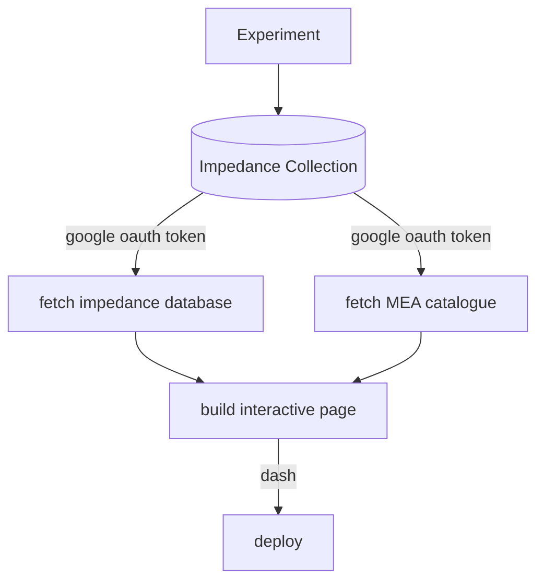

# MEA Impedance Dashboard

This repository build a dashboard for the experimental data.
Database is stored in private google drive (spreadsheet), and `plotly` is used for interactive graphs.
Lastly, `Dash` is used to build the reactive GUI.

## Pipeline

> User need to setup 'credentials.json' in the root directory to use google drive API. See [here](https://developers.google.com/drive/api/v3/quickstart/python) for more details.
> First time running the code will require user to authorize the app to access google drive.
> Generated token.json' will be used for future access. It should not be commited to github for security reasons.
